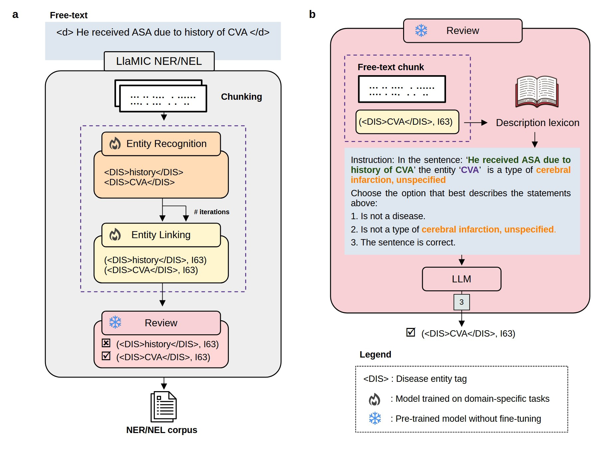
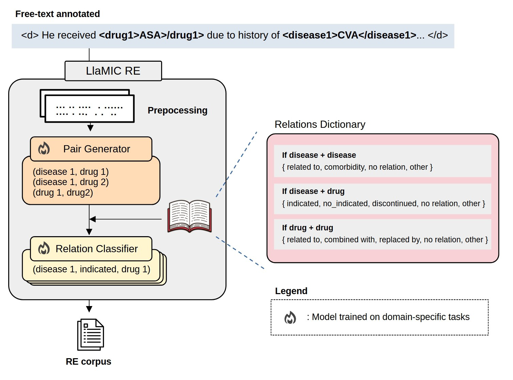

# LLaMIC : LLaMA Model Applied to MIMIC  
**Entity Recognition, Linking, and Relation Extraction for Cardiovascular and Cerebrovascular Diseases and Therapeutic Drugs in EHR CLinical Notes**

[](LICENSE)  
[](https://huggingface.co/)  
[](https://icd.who.int/)  

---

## Overview

**LLaMIC** is a modular pipeline designed for clinical entity recognition and standardization, focusing on identifying **cardiovascular and cerebrovascular disease (CCD) mentions**, their therapeutic drugs (CCDt), and binary relations in unstructured electronic health records (EHR) clinical notes.

LLaMIC combines instruction-tuned large language models (LLMs) with rule-based lexicons to achieve:

- **Named Entity Recognition (NER):** Recognition of CCD mentions within ICD-10 codes I20–I25 (ischemic heart diseases) and I60–I64 (cerebrovascular diseases), as well as CCDt mentions.
- **Named Entity Linking (NEL):** Linking recognized entities to standardized ICD-10/MeSH concepts.
- **Relation Extraction (RE):** Extracting binary relations between disease and drug entities.

The first two tasks are performed by **LLaMIC-Entities**, while the last is handled by **LLaMIC-RE**.

---

## LLaMIC_Entities
### Installation



Clone the repository and install required dependencies in your environment:

```bash
pip install -r requirements.txt
```

Set the model and lexicon paths in `call_llamic.sh`: Select the entity type (disease or drug) and specify the LLaMA model to use for the NER, NEL, and review phases. You can choose the Meta-Llama-3.1-8B-Instruct model (llama3.1) or provide the path to your own fine-tuned checkpoints. Note that access to Meta-Llama-3.1-8B-Instruct must first be requested from Hugging Face, as it is restricted (https://huggingface.co/meta-llama/Llama-3.1-8B-Instruct). 

Update the domain lexicon (lexicon.csv) with the target ICD-10 codes for diseases or MeSH codes and descriptions for drugs. Adjust the n_iterations parameter for NER if needed.

```bash
--entity_type disease (disease or drug)
--model_name_or_path_ner llama3.1 (default)
--model_name_or_path_nel llama3.1 (default)
--model_name_or_path_review llama3.1 (default)

--lexicon_path $datadir/lexicon.csv
--n_iterations 1 (default)
```


Run the LLaMIC on HPC with SLURM:
```bash
sbatch call_llamic.sh
```

### Results
The fine-tuned LAMIC model was evaluated on cardiovascular and cerebrovascular diseases and ICD-10 entity linking tasks. In MIMIC-IV notes dataset, it achieved precision scores of 0.83 (strict mode) and 0.89 (lenient mode) for disease identification. For ICD-10 linking, the model reached a precision of approximately 0.82.

---

## LLaMIC_RE
### Installation



Clone the repository and install required dependencies in your environment:

```bash
pip install -r requirements.txt
```

Set the model paths in `call_llamic.sh`: You can choose the Meta-Llama-3.1-8B-Instruct model (llama3.1) or provide the path to your own fine-tuned checkpoints. Note that access to Meta-Llama-3.1-8B-Instruct must first be requested from Hugging Face, as it is restricted (https://huggingface.co/meta-llama/Llama-3.1-8B-Instruct).

```bash
--model_name_or_path_pg llama3.1 (default)
--model_name_or_path_rc llama3.1 (default)
```


Run the LLaMIC on HPC with SLURM:
```bash
sbatch call_llamic.sh
```

### Results
The fine-tuned LLaMIC model was evaluated on the MIMIC-IV notes dataset. In the PG phase (Pair Generation), it achieved a precision score of 0.67.

## References

https://physionet.org/content/mimic-iv-note/2.2/

